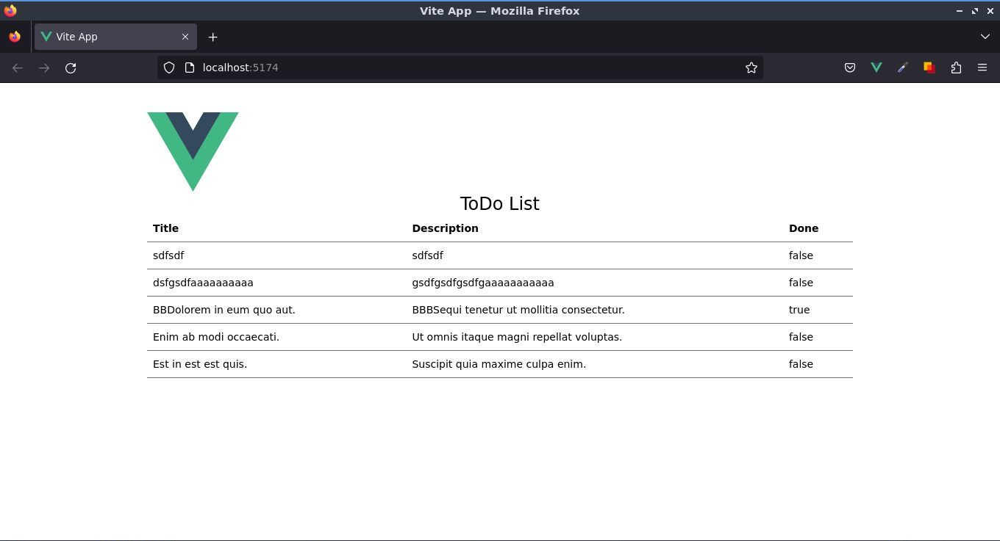

# Uso del Complemento de Vite para PWA


La mayoría de los complementos de Aplicaciones Web Progresivas, de los frameworks SPA, son bastante simples de implementar. Pero el complemento de Vite funciona en diferentes frameworks SPA. Este complemento funciona en el nivel de Vite/Build, no para su framework específico (o la falta de un framework). Eso significa que funcionará para Vue, React, SvelteKit y Vanilla JS (y cualquier otro desarrollo impulsado por Vite). Echémosle un vistazo.

## El Sitio Web

Antes de hacer nada de esto, debemos tener un sitio web en funcionamiento.



Crearemos una [Single Page Application (SPA) de Vue](https://vuejs.org/guide/extras/ways-of-using-vue.html#single-page-application-spa) en nuestra máquina local. El proyecto creado utilizará una configuración de compilación basada en [Vite](https://vitejs.dev/) y nos permitirá usar [Single-File Components (SFCs) de Vue](https://vuejs.org/guide/scaling-up/sfc.html).

Asegúrese de tener instalada una versión actualizada de [Node.js](https://nodejs.org/en) y de que su directorio de trabajo actual sea aquel en el que pretende crear el proyecto.

Ejecute la siguiente instrucción en su línea de comandos:

```sh
npm init vue@latest
```

Lo primero que nos preguntará el CLI es establecer el nombre del proyecto, siéntase libre de colocar el nombre del proyecto de su preferencia.


```sh
? Project name: › vue-project
```

En mi caso, colocaré el nombre del proyecto: `crud-todo-vue`.

```sh{3}
Vue.js - The Progressive JavaScript Framework

✔ Project name: … vue-todo-pwa
```

El CLI nos hará una serie de preguntas que definirán las características generales del proyecto. 

:::tip Nota
Para cumplir con el objetivo de este tutorial, seleccionaremos solo TypeScript y Vue Router, por ahora:
```sh{1,3}
✔ Add TypeScript? … Yes
✔ Add JSX Support? … No
✔ Add Vue Router for Single Page Application development? Yes
✔ Add Pinia for state management? No
✔ Add Vitest for Unit Testing? No
✔ Add an End-to-End Testing Solution? › No
✔ Add ESLint for code quality? No
✔ Add Prettier for code formatting? No
```
:::
>No se preocupe si por ahora no conoce mucho sobre TypeScript, [aquí será orientado al respecto](https://ecanquiz.github.io/how-to-code-in-typescript/) para irse familiarizando. Recuerde que su uso es altamente recomendado.

Entremos a la carpeta del proyecto e instalemos las dependencias.

```sh{5,6}
Scaffolding project in /home/ecanquiz/vue-todo-pwa...

Done. Now run:

  cd vue-todo-pwa
  npm install
  npm run dev
```

Implementaremos [Tailwindcss](https://tailwindcss.com/), para mejorar el estilo.

```sh
npm install -D tailwindcss postcss autoprefixer
npx tailwindcss init -p
```

Agreguemos las rutas a todos nuestros archivos de plantilla en el archivo creado en la raiz del proyecto.

`📃tailwind.config.js`

```js{4,5}
/** @type {import('tailwindcss').Config} */ 
module.exports = {
  content: [
    "./index.html",
    "./src/**/*.{vue,js,ts,jsx,tsx}",
  ],
  theme: {
    extend: {},
  },
  plugins: [],
}
```

Remplacemos el contenido del archivo `📃./src/assets/main.css` con las directivas de `@tailwind` y otras clases de estilos útiles.


```css
@tailwind base;
@tailwind components;
@tailwind utilities;

.btn { @apply text-white py-2 px-4 rounded transition; }
.btn-default { @apply bg-gray-500 hover:bg-gray-700; }
```
>El archivo `📃./src/assets/base.css` no lo usaremos, así que podemos eliminarlo.

Para realizar solicitudes HTTP instalaremos Axios.

```sh
npm i axios
```

Remplacemos todo el archivo de rutas con el siguiente contenido.

`./src/router/index.ts`

```ts
import { createRouter, createWebHistory } from 'vue-router'
import Index from '../views/Index.vue'

const router = createRouter({
  history: createWebHistory(import.meta.env.BASE_URL),
  routes: [{
      path: '/',
      name: 'index',
      component: Index
    }]
})

export default router
```

Remplacemos todo el archivo `App.vue` con el siguiente contenido:

`📃.src/views/Index.vue`
```vue
<script setup lang="ts">
import { RouterView } from 'vue-router'
</script>

<template>
  <div class="m-10">
    <header class="mx-auto w-full lg:w-3/4">
      
    </header>

    <RouterView />
  </div>
</template>
```

Eliminemos los archivos `AboutView.vue` y `HomeView.vue` ubicados en la carpeta `.src/views` y creemos dentro lo siguiente:

`📃.src/views/Index.vue`
```vue
<script setup lang="ts">
import useIndex from '../composables/useIndex'

const { pending, tasks } = useIndex()
</script>

<template>
  <div class="container mx-auto w-full lg:w-3/4">
    <h1 v-if="pending" class="text-2xl" align="center">Loading...</h1>
    <h1 v-else class="text-2xl" align="center">ToDo List</h1>
    <table class="min-w-full text-left text-sm font-light">
      <thead class="border-b font-medium dark:border-neutral-500">
        <tr>          
          <th class="p-2">Title</th>
          <th class="p-2">Description</th>
          <th class="p-2">Done</th>          
        </tr>
      </thead>
      <tbody>
        <tr
          v-for="task in tasks"
          :key="task.id"
          class="border-b dark:border-neutral-500"
        >          
          <td class="p-2">{{ task.title }}</td>
          <td class="p-2">{{ task.description }}</td>
          <td class="p-2">{{ task.done }}</td>
        </tr>
      </tbody>
    </table>
    <h4 v-if="tasks.length === 0">Empty list.</h4>
  </div>
</template>
```

Creemos el archivo `useIndex.ts` dentro de una nueva carpeta denominada `composables`.

`📃.src/composables/useIndex.ts`
```ts
import { ref, onMounted } from 'vue'
import * as Services from '@/services/'
import type { Ref } from 'vue'
import type { Task } from '@/types'

export default () => {
  const tasks: Ref<Task[]> = ref([])
  const pending = ref(false)

  const getTasks = () => {
    pending.value = true
    Services.getTasks()
      .then(response => tasks.value = response.data )
      .catch(
        error => console.log({
          errorCode: error.code, errorMessage: error.message
        })
      )
      .finally(() => pending.value = false)
  }

  onMounted(() => getTasks())

  return {
    pending,
    tasks
  }
}
```

Creemos una carpeta llamada `services` y agreguemos el archivo `ìndex.ts`.

`📃.src/services/index.ts`
```ts
import axios from 'axios'

const instance = axios.create({
  baseURL: import.meta.env.VITE_APP_API_URL
});

export const getTasks = async () => {
  return await instance.get("/tasks");
}
```

Creemos una carpeta llamada `types` y agreguemos el archivo `ìndex.ts`.

`📃.src/types/index.ts`
```ts
export type Task = {
  id: number;
  title: string;
  description: string;
  done: boolean;
  deleted_at?: Date;
  created_at: Date;
  updated_at: Date;
}
```

En la carpeta raiz, creemos el archivo `.env`.

`📃./.env`
```.env
VITE_APP_API_URL=https://my-json-server.typicode.com/ecanquiz/vue-todo-pwa
```

Si lo deses, puede borrar el contenido de la carpeta `components/`.


## Mi Servidor JSON

Cuando hablamos de [My JSON Server](https://my-json-server.typicode.com/) se trata de un servidor REST en línea falso.

La configuración de nuestros propios repositorios _**GitHub**_ es realmente fácil, simplemente continúe y siga las instrucciones en su sitio web y agregue un archivo `db.json` a la rama `main` o `master` de su repositorio, luego puede acceder y usarlo a través de la estructura de URL que proporcionan como punto final de la API REST.

Ya seguí adelante y creé esto para nosotros, para que podamos usarlo con el repositorio de este tutorial. La URL de nuestra API REST es: 

[`https://my-json-server.typicode.com/ecanquiz/vue-todo-pwa`](https://my-json-server.typicode.com/ecanquiz/vue-todo-pwa).

Cuando abra el servidor, notará que en recursos tenemos a [`/tasks`](https://my-json-server.typicode.com/ecanquiz/vue-todo-pwa/tasks) para consumir.


## Para instalarlo, solo necesita agregarlo a sus dependencias de tiempo de desarrollo:

```sh
npm i vite-plugin-pwa --save-dev
```

Una vez instalado, puede agregarlo a su archivo `vite.config.ts`:

```ts
...
import { VitePWA } from "vite-plugin-pwa";

// https://vitejs.dev/config/
export default defineConfig({
  plugins: [
    vue(),
    VitePWA()
  ],
  ...
})
```

Con esto instalado, verá que sus compilaciones generarán algunos archivos adicionales:

```sh
vite v4.4.8 building for production...
✓ 83 modules transformed.
dist/registerSW.js                0.16 kB
dist/manifest.webmanifest         0.17 kB
dist/index.html                   0.61 kB │ gzip:  0.34 kB
dist/assets/logo-4ca08a15.svg     2.66 kB │ gzip:  1.24 kB
dist/assets/index-6ac42a59.css    8.15 kB │ gzip:  2.30 kB
dist/assets/Edit-acc6f70c.js      1.68 kB │ gzip:  0.90 kB
dist/assets/index-14d96737.js   109.31 kB │ gzip: 43.23 kB

PWA v0.16.4
mode      generateSW
precache  6 entries (117.10 KiB)
files generated
  dist/sw.js
  dist/workbox-27b29e6f.js
✓ built in 5.57s 
```


El archivo generado por el complemento incluye:

- **manifest.webmanifest**: Metadatos sobre la aplicación y una indicación de que se puede instalar.
- **sw.js**: Un `service worker`requerido que admite la ejecución como una aplicación (y sin conexión).
- **registerSW.js**: Un nuevo script que Vite inyecta en el `index.html` que registra al `service worker`.
- **workbox-*.js**: Código específico del `workbox` para admitir la PWA.

Con esto generado, debería ver el "icono de instalación" en los navegadores compatibles:


## https://vite-pwa-org.netlify.app/assets-generator/

## Ejemplo usando un preajuste mínimo

Puede generar íconos utilizando el ajuste preestablecido `minimal` incluido en el paquete [`@vite-pwa/assets-generator`](https://github.com/vite-pwa/assets-generator) a través de una imagen de origen, consulte la documentación de la [CLI](https://vite-pwa-org.netlify.app/assets-generator/cli.html) y la [API](https://vite-pwa-org.netlify.app/assets-generator/api.html) para obtener más detalles.

```sh
npm install -D @vite-pwa/assets-generator
```

```json
{
  "scripts": {
    "generate-pwa-assets": "pwa-assets-generator --preset minimal public/logo.png"
  }
}
```

```sh
npm run generate-pwa-assets
```


```sh
> vue-todo-pwa@0.0.0 generate-pwa-assets
> pwa-assets-generator --preset minimal public/logo.png

Zero Config PWA Assets Generator v0.0.4                                          5:16:13 PM
◐ Preparing to generate PWA assets...                                            5:16:13 PM
✔ PWA assets ready to be generated                                               5:16:13 PM
◐ Generating PWA assets from public/logo.png image                               5:16:13 PM
✔ Generated PNG file: ~/vue-todo-pwa/public/pwa-64x64.png                        5:16:13 PM
✔ Generated PNG file: ~/vue-todo-pwa/public/pwa-192x192.png                      5:16:13 PM
✔ Generated ICO file: ~/vue-todo-pwa/public/favicon.ico                          5:16:13 PM
✔ Generated PNG file: ~/vue-todo-pwa/public/apple-touch-icon-180x180.png         5:16:13 PM
✔ Generated PNG file: ~/vue-todo-pwa/public/maskable-icon-512x512.png            5:16:13 PM
✔ Generated PNG file: ~/vue-todo-pwa/public/pwa-512x512.png                      5:16:13 PM
✔ PWA assets generated  
```

:::info
Todos los assets de PWA se generarán en la misma carpeta de origen.
:::


Actualice su entrada de iconos del manifiesto de la PWA con:

```ts
...
VitePWA({      
  manifest: { 
    icons: [{
      src: 'pwa-64x64.png',
      sizes: '64x64',
      type: 'image/png'
    }, {
      src: 'pwa-192x192.png',
      sizes: '192x192',
      type: 'image/png'
    }, {
      src: 'pwa-512x512.png',
      sizes: '512x512',
      type: 'image/png',
      purpose: 'any'  
    }, {
      src: 'maskable-icon-512x512.png',
      sizes: '512x512',
      type: 'image/png',
      purpose: 'maskable'
    }]
  }
})
...
```

y use las siguientes entradas de encabezado HTML en su punto de entrada:

```html
<head>
  <link rel="icon" href="/favicon.ico" sizes="any">
  <link rel="icon" href="/favicon.svg" type="image/svg+xml">
  <link rel="apple-touch-icon" href="/apple-touch-icon-180x180.png">
</head>
```

https://stackoverflow.com/questions/58985103/progressive-web-app-not-showing-install-button-in-browser-bar
The properties that you can customize in the manifest are all defined here.

If you run the example now, you can look at the manifest for errors or omissions:
