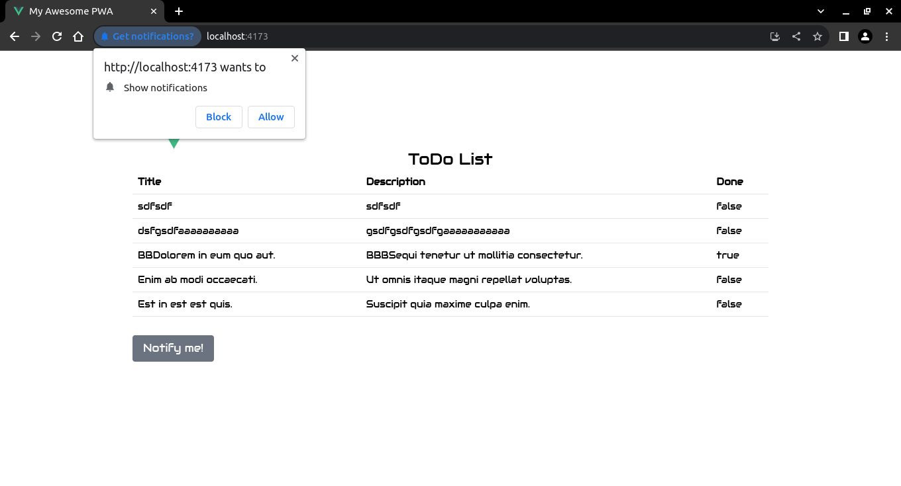

# Notificaciones

## `usePermission` de VueUse

Para conocer si nuestra aplicación ya posee (otorgado o no) el permisos de notificación, utilizaremos [`usePermission`](https://vueuse.org/core/usePermission/#usepermission) de la colección de utilidades de composición esenciales de [VueUse](https://vueuse.org/).


```sh
npm i @vueuse/core
```

## Notificaciones

>En este apartado agregaremos, a nuestra [PWA desarrollada en la sección anterior](./pwa-for-vite/create-website.html) con Vue, un ejemplo de [Notificación](https://developer.mozilla.org/en-US/docs/Web/API/Notification) migrado desde [Vanilla JavaScript](https://mdn.github.io/dom-examples/to-do-notifications/).

Copie y pegue dentro del archivo `.src/App.vue` el siguiente código.

`📃./src/App.vue`
```vue
<script setup lang="ts">
import { computed, ref } from 'vue'
import { RouterView } from 'vue-router'
import { usePermission } from '@vueuse/core'

const notifications = ref(
  usePermission('notifications')
)

const permission = computed(
  () => notifications.value === "granted"
)

const notifyMe = () => {
  // We check if the browser supports notifications
  if (!("Notification" in window)) {
    alert(
      "This browser does not support desktop notifications",
    );
  }

  // We check if the permissions have been granted before
  else if (Notification.permission === "granted") {
    // If it is correct, we launch a notification
    const notification = new Notification(
      "Hi, permissions have been granted before!"
    );
  }

  // If not, we ask permission for notification
  else if (Notification.permission !== "denied") {
    Notification.requestPermission().then(function (permission) {
      // If the user grants us, we create the notification
      if (permission === "granted") {
        const notification = new Notification(
          "Hi, permissions are granted now!"
        );
      }
    });
  }

  // Lastly, if the user has denied permission,
  // and wants to be respectful, there's no need to bother them.
}
</script>

<template>
  <div class="m-10">
    <header class="mx-auto w-full lg:w-3/4">
      
    </header>

    <RouterView />

    <div class="mx-auto w-full lg:w-3/4 mt-7">
      <button
        v-if='!permission'
        class="btn btn-default"
        @click="notifyMe"
      >
        Notify me!
      </button>
      <button
        v-else='permission'
        class="btn btn-default"
        @click="notifyMe"
      >
        Try to notify me!
      </button>
    </div>
  </div>
</template>
```

De vuelta, cuando refresque su aplicación, el navegador le preguntará si desea mostrar notificaciones.



Si lo acepta, el navegador mostrará notificaciones.


## ServiceWorkerRegistration: showNotification() method

:::warning Advertencia
La interfaz de [Notification](https://developer.mozilla.org/en-US/docs/Web/API/Notification) de la [API de Notifications](https://developer.mozilla.org/en-US/docs/Web/API/Notifications_API) solo se utiliza para configurar y mostrar notificaciones de escritorio al usuario. No funciona en dispositivos móviles como celulares.
:::

Para que nuestra aplicación pueda mandar notificaciones tanto a dispositivos de escritorio como también a moviles utilizaremos el [método `showNotification()` del Registro de Trabajador de Servicio](https://developer.mozilla.org/en-US/docs/Web/API/ServiceWorkerRegistration/showNotification). Este método permite mandar notificaciones tanto a dispositivos de escritorio como también a moviles, pero solo en contextos seguros ([HTTPS](https://en.wikipedia.org/wiki/HTTPS)). Por lo tanto, para poder probar las notificaciones tanto en el ambiente de desarrollo como también en el ambiente de producción, haremos la siguiente modificación a la función `notifyMe`:


```ts{12,13,14,15,16,17,18,26,27,28,29,30,31,32}
const notifyMe = () => {
  // We check if the browser supports notifications
  if (!("Notification" in window)) {
    alert(
      "This browser does not support desktop notifications",
    );
  }

  // We check if the permissions have been granted before
  else if (Notification.permission === "granted") {
    // If it is correct, we launch a notification
    if (import.meta.env.DEV) {
      const notification = new Notification("Hi dev, permissions have been granted before!");
    } else if (import.meta.env.PROD) {
      navigator.serviceWorker.ready.then((registration) => {
        registration.showNotification("Hi prod, permissions have been granted before!");
      });
    }
  }

  // If not, we ask permission for notification
  else if (Notification.permission !== "denied") {
    Notification.requestPermission().then(function (permission) {
      // If the user grants us, we create the notification
      if (permission === "granted") {
        if (import.meta.env.DEV) {
          const notification = new Notification("Hi dev, permissions are granted now!");
        } else if (import.meta.env.PROD) {          
          navigator.serviceWorker.ready.then((registration) => {
            registration.showNotification("Hi prod, permissions are granted now!");
          });          
        }
      }
    });
  }

  // Lastly, if the user has denied permission,
  // and wants to be respectful, there's no need to bother them.
}
```


