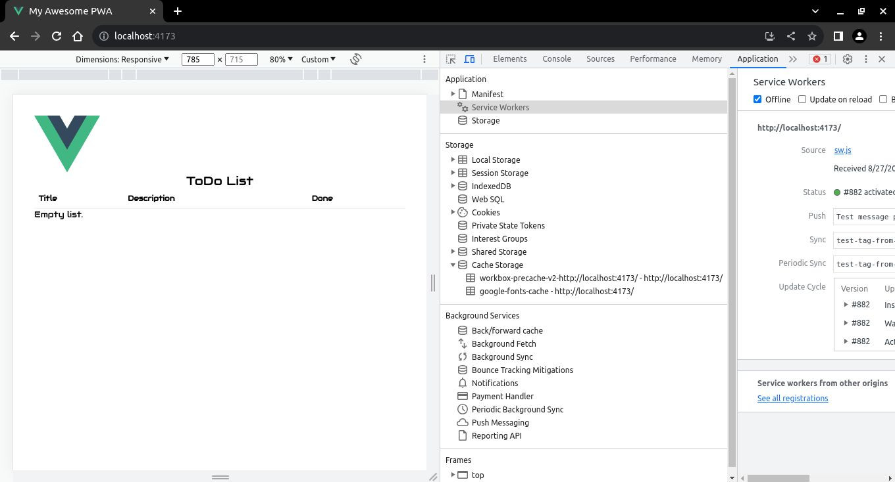

# Caché de Recursos Externos

Si usa algún CDN para descargar algunos recursos como fuentes y css, debe incluirlos en el precaché del **_service worker_**, y [así su aplicación funcionará cuando esté fuera de línea](https://vite-pwa-org.netlify.app/workbox/generate-sw.html#cache-external-resources).

El siguiente ejemplo utilizará css de https://fonts.googleapis.com.

En el archivo `index.html` debe configurar el enlace `css`, también **DEBE** incluir el atributo `crossorigin="anonymous"` para los recursos externos (consulte [Manejar Solicitudes de Terceros](https://developer.chrome.com/docs/workbox/caching-resources-during-runtime/#cross-origin-considerations)):

`📃./index.html`
```html
<link rel="dns-prefetch" href="https://fonts.googleapis.com">
<link rel="preconnect" crossorigin="anonymous" href="https://fonts.googleapis.com">
<link rel="stylesheet" href="https://fonts.googleapis.com/css?family=Audiowide">
<style>body { font-family: "Audiowide", sans-serif;}</style>
```

Ahora su sitio se lucirá así:


Luego, en su archivo `vite.config.ts`, agregue el siguiente código:

`📃./vite.config.ts`

```ts
VitePWA({
  // omitted for brevity ...
  workbox: {
    // omitted for brevity ...
    runtimeCaching: [
      {
        urlPattern: /^https:\/\/fonts\.googleapis\.com\/.*/i,
        handler: 'CacheFirst' as const,
        options: {
          cacheName: 'google-fonts-cache',
          cacheableResponse: {
            statuses: [0, 200]
          }
        }
      }
    ]
  },
  // omitted for brevity ...
})
```

## Fuera de Línea 

Puede desconectarse cambiando la red a `Offline`. Si actualiza la página, obtendrá algo similar a esto:


