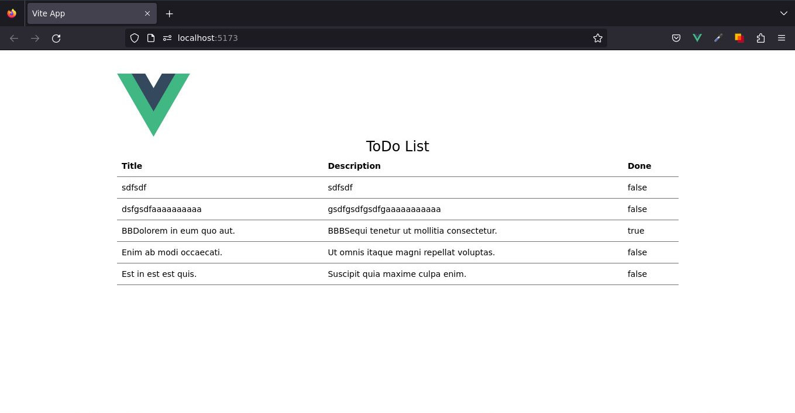

# Crear Sitio Web

Antes de hacer nada de esto, debemos tener un sitio web en funcionamiento.

:::tip Práctica
En esta sección desarrollaremos una SPA con Vue y la convertiremos en PWA con el respectivo complemento para Vite. Si de momento no desea seguir esta práctica, siéntase libre de pasar directamente a la siguiente sección para aprender a [usar este complemento](../pwa-for-vite/plugin-usage.html). 
:::

Crearemos una [Single Page Application (SPA) de Vue](https://vuejs.org/guide/extras/ways-of-using-vue.html#single-page-application-spa) en nuestra máquina local. El proyecto creado utilizará una configuración de compilación basada en [Vite](https://vitejs.dev/) y nos permitirá usar [Single-File Components (SFCs) de Vue](https://vuejs.org/guide/scaling-up/sfc.html).

Asegúrese de tener instalada una versión actualizada de [Node.js](https://nodejs.org/en) y de que su directorio de trabajo actual sea aquel en el que pretende crear el proyecto.

## Ejecute la siguiente instrucción en su línea de comandos:

```sh
npm init vue@latest
```

Lo primero que nos preguntará el CLI es establecer el nombre del proyecto, siéntase libre de colocar el nombre del proyecto de su preferencia.


```sh
? Project name: › vue-project
```

En mi caso, colocaré el nombre del proyecto: `crud-todo-vue`.

```sh{3}
Vue.js - The Progressive JavaScript Framework

✔ Project name: … vue-todo-pwa
```

El CLI nos hará una serie de preguntas que definirán las características generales del proyecto. 

:::tip Nota
Para cumplir con el objetivo de este tutorial, seleccionaremos solo TypeScript y Vue Router.
```sh{1,3}
✔ Add TypeScript? … Yes
✔ Add JSX Support? … No
✔ Add Vue Router for Single Page Application development? Yes
✔ Add Pinia for state management? No
✔ Add Vitest for Unit Testing? No
✔ Add an End-to-End Testing Solution? › No
✔ Add ESLint for code quality? No
✔ Add Prettier for code formatting? No
```
:::
>No se preocupe si por ahora no conoce mucho sobre [TypeScript](https://ecanquiz.github.io/how-to-code-in-typescript/), será orientado al respecto para irse familiarizando. Recuerde que su uso es altamente recomendado.

Entremos a la carpeta del proyecto e instalemos las dependencias.

```sh{3,4}
Done. Now run:

  cd vue-todo-pwa
  npm install
```

## Instale [Tailwindcss](https://tailwindcss.com/), para darle un poco de estilo.

```sh
npm install -D tailwindcss postcss autoprefixer
npx tailwindcss init -p
```

Agregue las rutas a todos sus archivos de plantilla en el archivo creado en la raiz del proyecto.

`📃./tailwind.config.js`

```js{4,5}
/** @type {import('tailwindcss').Config} */ 
module.exports = {
  content: [
    "./index.html",
    "./src/**/*.{vue,js,ts,jsx,tsx}",
  ],
  theme: {
    extend: {},
  },
  plugins: [],
}
```

Remplacemos el contenido del archivo `📃./src/assets/main.css` con las directivas de `@tailwind` y algunas clases útiles.

```css{1,2,3}
@tailwind base;
@tailwind components;
@tailwind utilities;

.btn { @apply text-white py-2 px-4 rounded transition; }
.btn-default { @apply bg-gray-500 hover:bg-gray-700; }
```
>No usaremos el archivo `📃./src/assets/base.css`, así que puede eliminarlo.
Si lo desea, puede borrar el contenido de la carpeta `components/`.


## Instale [Axios](https://axios-http.com/) para usar los [métodos de petición HTTP](https://developer.mozilla.org/en-US/docs/Web/HTTP/Methods).

```sh
npm i axios
```


## Mi Servidor JSON

Cuando hablamos de [My JSON Server](https://my-json-server.typicode.com/) se trata de un servidor REST en línea falso.

La configuración de nuestros propios repositorios _**GitHub**_ es realmente fácil, simplemente continúe y siga las instrucciones en su sitio web y agregue un archivo `db.json` a la rama `main` o `master` de su repositorio, luego puede acceder y usarlo a través de la estructura de URL que proporcionan como punto final de la API REST.

Ya seguí adelante y creé esto para nosotros, para que podamos usarlo con el repositorio de este tutorial. La URL de nuestra API REST es: 

[`https://my-json-server.typicode.com/ecanquiz/vue-todo-pwa`](https://my-json-server.typicode.com/ecanquiz/vue-todo-pwa).

Cuando abra el servidor, notará que en recursos tenemos a [`/tasks`](https://my-json-server.typicode.com/ecanquiz/vue-todo-pwa/tasks) para consumir.


## En la carpeta raiz, creemos el archivo `.env`.

`📃./.env`
```.env
VITE_APP_API_URL=https://my-json-server.typicode.com/ecanquiz/vue-todo-pwa
```

## Creemos una carpeta llamada `types` y agreguemos el archivo `ìndex.ts`.

`📃./src/types/index.ts`
```ts
export type Task = {
  id: number;
  title: string;
  description: string;
  done: boolean;
  deleted_at?: Date;
  created_at: Date;
  updated_at: Date;
}
```

## Creemos una carpeta llamada `services` y agreguemos el archivo `ìndex.ts`.

`📃./src/services/index.ts`
```ts
import axios from 'axios'

const instance = axios.create({
  baseURL: import.meta.env.VITE_APP_API_URL
});

export const getTasks = async () => {
  return await instance.get("/tasks");
}
```


## Creemos el archivo `useIndex.ts` dentro de una nueva carpeta denominada `composables`.

`📃./src/composables/useIndex.ts`
```ts
import { ref, onMounted } from 'vue'
import * as Services from '@/services/'
import type { Ref } from 'vue'
import type { Task } from '@/types'

export default () => {
  const tasks: Ref<Task[]> = ref([])
  const pending = ref(false)

  const getTasks = () => {
    pending.value = true
    Services.getTasks()
      .then(response => tasks.value = response.data )
      .catch(
        error => console.log({
          errorCode: error.code, errorMessage: error.message
        })
      )
      .finally(() => pending.value = false)
  }

  onMounted(() => getTasks())

  return {
    pending,
    tasks
  }
}
```


## Eliminemos los archivos `AboutView.vue` y `HomeView.vue` ubicados en la carpeta `.src/views` y creemos dentro lo siguiente:

`📃./src/views/Index.vue`
```vue
<script setup lang="ts">
import useIndex from '../composables/useIndex'

const { pending, tasks } = useIndex()
</script>

<template>
  <div class="container mx-auto w-full lg:w-3/4">
    <h1 v-if="pending" class="text-2xl" align="center">Loading...</h1>
    <h1 v-else class="text-2xl" align="center">ToDo List</h1>
    <table class="min-w-full text-left text-sm font-light">
      <thead class="border-b font-medium dark:border-neutral-500">
        <tr>          
          <th class="p-2">Title</th>
          <th class="p-2">Description</th>
          <th class="p-2">Done</th>          
        </tr>
      </thead>
      <tbody>
        <tr
          v-for="task in tasks"
          :key="task.id"
          class="border-b dark:border-neutral-500"
        >          
          <td class="p-2">{{ task.title }}</td>
          <td class="p-2">{{ task.description }}</td>
          <td class="p-2">{{ task.done }}</td>
        </tr>
      </tbody>
    </table>
    <h4 v-if="tasks.length === 0">Empty list.</h4>
  </div>
</template>
```


## Remplacemos todo el archivo `App.vue` con el siguiente contenido:

`📃./src/views/Index.vue`
```vue
<script setup lang="ts">
import { RouterView } from 'vue-router'
</script>

<template>
  <div class="m-10">
    <header class="mx-auto w-full lg:w-3/4">
      
    </header>

    <RouterView />
  </div>
</template>
```


## Remplacemos todo el archivo de rutas con el siguiente contenido.

`./src/router/index.ts`

```ts
import { createRouter, createWebHistory } from 'vue-router'
import Index from '../views/Index.vue'

const router = createRouter({
  history: createWebHistory(import.meta.env.BASE_URL),
  routes: [{
      path: '/',
      name: 'index',
      component: Index
    }]
})

export default router
```

## Listo


