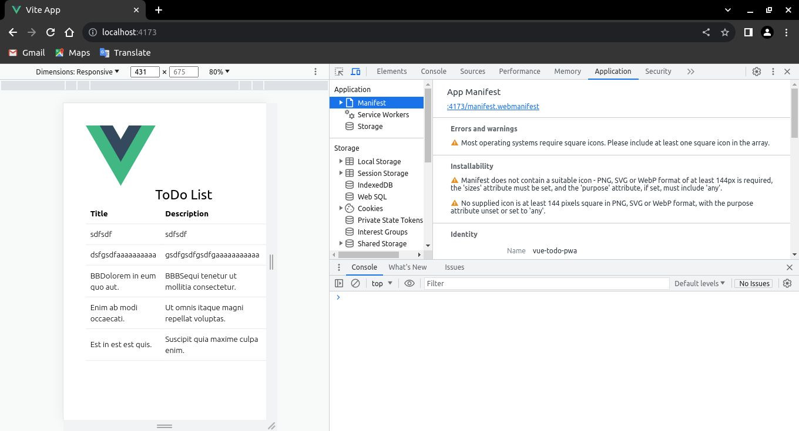

# Uso del Complemento

## Instalación

Para instalarlo, solo necesita agregarlo a sus dependencias de tiempo de desarrollo:

```sh
npm i -D vite-plugin-pwa
```

Una vez instalado, puede agregarlo a su archivo de configuracipon de Vite:

`📃./vite.config.ts`

```ts{2,8}
...
import { VitePWA } from "vite-plugin-pwa";

// https://vitejs.dev/config/
export default defineConfig({
  plugins: [
    vue(),
    VitePWA()
  ],
  // omitted for brevity ...
})
```

Con esto instalado, verá que sus compilaciones generarán algunos archivos adicionales:

```sh{3,4,14,15}
vite v4.4.9 building for production...
✓ 74 modules transformed.
dist/registerSW.js                0.13 kB
dist/manifest.webmanifest         0.14 kB
dist/assets/logo-277e0e97.svg     0.28 kB │ gzip:  0.20 kB
dist/index.html                   0.54 kB │ gzip:  0.33 kB
dist/assets/index-0ceecadb.css    6.26 kB │ gzip:  1.90 kB
dist/assets/index-6b8b81cc.js   104.60 kB │ gzip: 41.35 kB

PWA v0.16.4
mode      generateSW
precache  5 entries (108.92 KiB)
files generated
  dist/sw.js
  dist/workbox-27b29e6f.js
✓ built in 5.41s
```


El archivo generado por el complemento incluye:

- `manifest.webmanifest`: Metadatos sobre la aplicación y una indicación de que se puede instalar.
- `sw.js`: Un _**service worker**_ requerido que admite la ejecución como una aplicación (y sin conexión).
- `registerSW.js`: Un nuevo script que Vite inyecta en el _**index.html**_ que registra al _**service worker**_.
- `workbox-*.js`: Código específico del _*workbox*_ para admitir la PWA.

Con esto generado, debería ver el "icono de instalación" en los navegadores compatibles, sin embargo, ello requiere un preajuste mínimo.



:::tip Consejo
Para usar un [Preajuste Mínimo](https://vite-pwa-org.netlify.app/assets-generator/#example-using-minimal-preset) empiece generando los `assets`.
:::

## Generador de Assets

El [Generador de Assets de PWA](https://vite-pwa-org.netlify.app/assets-generator/) es muy fácil de usar. Usted puede generar íconos utilizando el ajuste preestablecido `minimal` incluido en el paquete [`@vite-pwa/assets-generator`](https://github.com/vite-pwa/assets-generator) a través de una imagen de origen, consulte la documentación de la [CLI](https://vite-pwa-org.netlify.app/assets-generator/cli.html) y la [API](https://vite-pwa-org.netlify.app/assets-generator/api.html) para obtener más detalles.

Para instalar `@vite-pwa/assets-generator`, simplemente agréguelo a su proyecto como una dependencia de desarrollo
```sh
npm i -D @vite-pwa/assets-generator
```

Para este ejemplo utilizaré el `logo.svg` de Vue, que viene ya por defecto en la carpeta `./src/assets/`. Siéntase libre de usar el logo de su preferencia. Luego actualice su archivo `package.json`.

`📃./package.json`
```json
{
  "scripts": {
    ...
    "generate-pwa-assets": "pwa-assets-generator --preset minimal public/logo.svg"
  }
}
```

Tenga en cuenta que deberá colocar el _logo_ en la carpeta `public`. Entonces, ejecute la generación de los `assets`.

```sh
npm run generate-pwa-assets
```

Con realizar estos pasos ya sus `assets` fueron generados correctamente en la misma carpeta de origen. Avancemos con la configuración.

## Entrada de Íconos

Actualice su entrada de íconos del manifiesto de la PWA con:

```ts
// omitted for brevity ...
VitePWA({
  manifest: {
    icons: [{
      src: 'pwa-64x64.png',
      sizes: '64x64',
      type: 'image/png'
    }, {
      src: 'pwa-192x192.png',
      sizes: '192x192',
      type: 'image/png'
    }, {
      src: 'pwa-512x512.png',
      sizes: '512x512',
      type: 'image/png',
      purpose: 'any'  
    }, {
      src: 'maskable-icon-512x512.png',
      sizes: '512x512',
      type: 'image/png',
      purpose: 'maskable'
    }]
  }
}),
// omitted for brevity ...
```

Al compilar y previsualizar nuevamente verá el "icono de instalación" en los navegadores compatibles.


